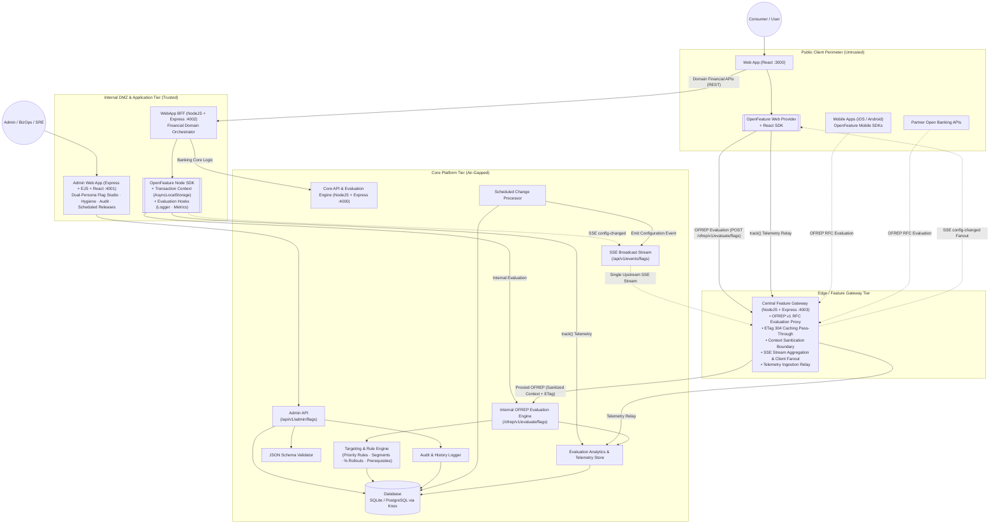

# INTENT

## Objective/s
- Demonstrate the value of using OpenFeature in an enterprise setting through the development of a Proof-of-Concept.
- Demonstrate the value of creating a centralized, runtime configuration management capability.
- Provide a hands-on feel of the operational aspects of using feature flags for release management and scaling common, global codebases.

## Constraints
- Build only. No commercial options allowed.
- SQLite for persistence out of the box, with a database abstraction layer (Knex.js) ensuring zero-code-change swappability to PostgreSQL.

## Requirements

### Functional Requirements

#### Feature Flag and Configuration Consumption
- **Unified OpenFeature Flag Types**: Dynamic configurations and feature toggles are unified under OpenFeature typed evaluations: `Boolean`, `String`, `Number`, and `Object` (structured JSON config).
- **Evaluation Semantics & Safe Defaults**:
  - Evaluation follows standard OpenFeature semantics: consumers provide a fallback default value (from environment variables or hardcoded constants).
  - If a flag is disabled, not found, or encounters an evaluation error, the OpenFeature SDK safely falls back to the consumer-provided default value with resolution reason (`DISABLED`, `DEFAULT`, or `ERROR`).
- **Context-Aware Evaluation & Rule Precedence**:
  - Multi-dimensional variations (defaults, operational preferences, business-unit levels, country levels) are resolved dynamically using an **Evaluation Context** (e.g. `targetingKey`, `country`, `businessUnit`, `appId`, `environment`).
  - Rules are evaluated in an explicit **Rule Priority Hierarchy** (e.g., Target User > Country > Business Unit > Default Variant).
- **Percentage / Gradual Rollouts**:
  - Rules support percentage-based fractional rollouts using deterministic hashing (MurmurHash3) on `targetingKey`, ensuring **sticky bucketing** — the same user consistently receives the same variant across evaluations.
  - Enables canary-style release patterns (e.g., "roll out to 10% of users, monitor, then ramp to 50%") without infrastructure changes.
- **Flag Dependencies / Prerequisites**:
  - Flags can declare prerequisite flags that must resolve to a specific variant before the dependent flag's own rules are evaluated.
  - If any prerequisite is unmet, the dependent flag returns its default variant with resolution reason `PREREQUISITE_FAILED`.
  - Prevents cascading misconfigurations when features depend on each other (e.g., `feature.advanced-financial-insights` requires `feature.chatbot-gemini-ui` to be enabled).

#### Flag Scoping and Multi-Application Coordination
- Feature flags are scoped using OpenFeature Scopes/Domains and context attributes (`appId`, `appGroup`, `environment`).
- Flags can be tagged and grouped across multiple consumer applications (e.g. `webapp` and `bff`) to enable coordinated multi-tier rollouts.
- **Reusable User Segments**: Targeting audiences (e.g., "Premium APAC Users", "Internal Beta Testers") are defined as named, reusable segments with their own conditions. Flag rules reference segments by ID, reducing duplication and ensuring consistency across the flag inventory.

#### Feature Flag Inventory, Lifecycle & History
- The Admin Web App must display an inventory of all feature flags including:
  - Key, Type, Lifecycle State
  - Application tags and scope
  - Creation date, age, last updated timestamp, and description
- Inspect the **last 5 revisions** of any feature flag or dynamic configuration, displaying full snapshots, change diffs, author, and timestamp.
- **Flag Lifecycle State Machine**: Flags progress through defined lifecycle states — `DRAFT` → `ENABLED` → `DISABLED` → `GRADUATED` → `ARCHIVED`.
  - `DRAFT` flags are not evaluable (return default value).
  - `GRADUATED` flags are frozen and read-only — indicating the feature is permanent and the flag code reference should be removed.
  - `ARCHIVED` flags are soft-deleted and hidden from the active inventory.
- **Stale Flag Detection & Hygiene**: The Admin Web App surfaces flags needing attention:
  - Flags with `state: ENABLED` and no rule changes in 30+ days.
  - Flags where 100% of evaluations resolve to the same variant (effectively hardcoded).
  - Flags with `state: DISABLED` for 14+ days (candidates for deletion or archival).

#### Feature Flag Authoring & Governance
- **OpenFeature & OFREP Conformance**: Core API evaluation endpoints conform to the OpenFeature Remote Evaluation Protocol (OFREP) specification.
- **Audit Logging**: Every create, update, and delete operation is recorded in an immutable audit log (`flag_history`).
- **Description**: Each feature flag or configuration must have a descriptive summary of its purpose.
- **Schema Validation**: JSON Schema (Draft 7/2020-12) validation for `OBJECT` variant payloads to ensure configuration integrity before persistence.
- **Scheduled Flag Changes**: Flag mutations (state changes, rule updates, variant swaps) can be scheduled for a future timestamp and applied automatically. Supports time-based release management scenarios such as marketing campaign launches, maintenance windows, and regulatory go-live dates.
- **Extensibility** (Future): Maker-checker approval workflow hooks for production sign-offs.

#### OpenFeature SDK Extensibility
- **Evaluation Lifecycle Hooks**: Consumer applications register OpenFeature hooks (`before`, `after`, `error`, `finally`) to extend the evaluation pipeline without modifying flag evaluation call sites:
  - **Evaluation Logger Hook** (`after` + `error`): Emits structured JSON logs for every flag evaluation — `{ flagKey, variant, reason, latencyMs, targetingKey }`.
  - **Metrics Hook** (`finally`): Increments evaluation counters partitioned by flag key, variant, and resolution reason; records evaluation latency.
  - **Context Enrichment Hook** (`before`): Auto-injects server-side context (request metadata, `appId`, session ID) into the evaluation context so callers don't need to manually construct it.
- **Transaction Context Propagation**: The BFF uses Node.js `AsyncLocalStorage` via OpenFeature's `TransactionContextPropagator` to bind user context (from request headers) once in Express middleware. All downstream `client.getBooleanValue()` calls automatically receive the context without explicit parameter passing.
- **Tracking API**: Consumer applications use `client.track(eventName, context, details)` to record user behaviours and conversion events (e.g., `chatbot_message_sent`, `loan_simulated`) through the OpenFeature client, linking feature flag exposure to business outcomes without coupling to vendor-specific analytics SDKs.

### Non-Functional Requirements
- **API Standards**: Core API must follow OpenAPI (REST) specifications for evaluation and administrative operations.
- **Change Propagation & Eventing**:
  - Core API provides a Server-Sent Events (SSE) stream (`/api/v1/events/flags`) broadcasting `PROVIDER_CONFIGURATION_CHANGED` events upon flag mutations.
  - OpenFeature SDK providers listen to the SSE stream to invalidate local cache and trigger reactive UI/service re-evaluations instantly.
  - Configurable fallback REST polling interval for disconnected or non-streaming clients.
- **Bulk Evaluation with HTTP Caching**: OFREP bulk evaluation responses include an `ETag` header (derived from flag version hashes). Subsequent client requests with `If-None-Match` receive `304 Not Modified` when no flags have changed, minimising bandwidth and re-rendering latency.
- **Evaluation Analytics**: Each OFREP evaluation is counted by `{ flagKey, variant, reason }`. The Admin Web App displays evaluation distribution (variant split per flag) to answer: *"Which flags are being used, by whom, and how often?"*

---

## High-level Solution

### Architecture Overview

The system architecture employs an **Edge Feature Gateway** (`feature-gateway` on port 4003) to air-gap the internal Core API & Rules Engine (`api:4000`) from untrusted public clients (Web, Mobile, Partner APIs). Public clients consume feature flags via the standard OpenFeature Remote Evaluation Protocol (OFREP v1) proxied through the Gateway with high-throughput ETag HTTP 304 caching, context sanitization, and SSE aggregation/fanout. Internal trusted services (WebApp BFF, Admin Web App) communicate with the Core Platform within the protected network boundary.

