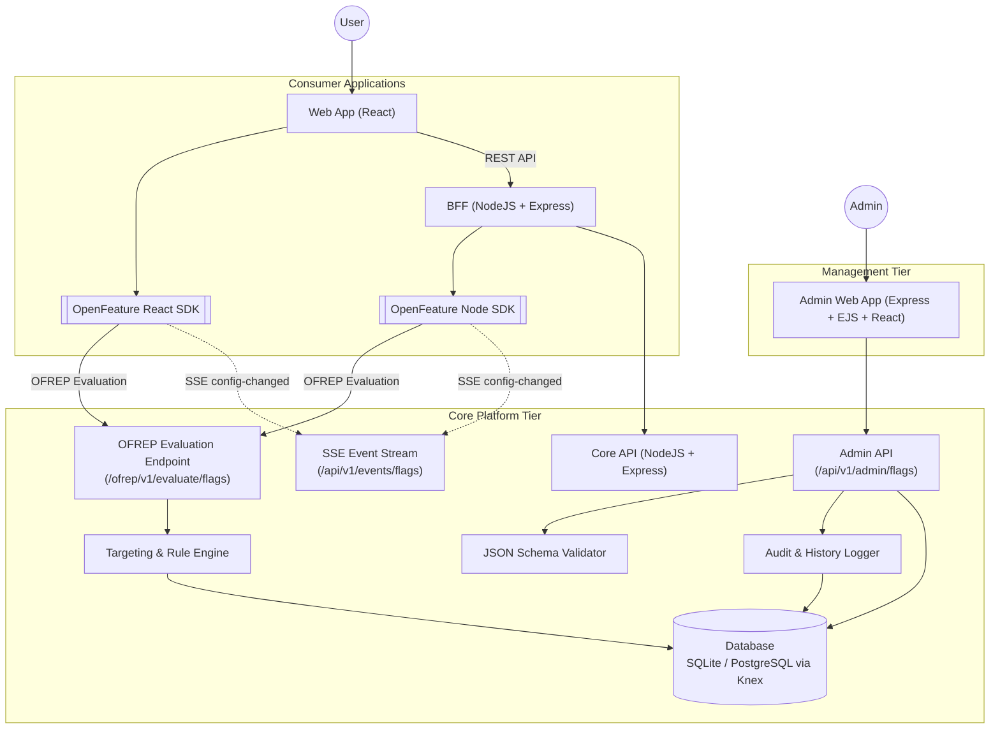

# INTENT

## Objective/s
- Demonstrate the value of using OpenFeature in an enterprise setting through the development of a Proof-of-Concept.
- Demonstrate the value of creating a centralized, runtime configuration management capability.
- Provide a hands-on feel of the operational aspects of using feature flags for release management and scaling common, global codebases.

## Constraints
- Build only. No commercial options allowed.
- SQLite for persistence out of the box, with a database abstraction layer (Knex.js) ensuring zero-code-change swappability to PostgreSQL.

## Requirements

### Functional Requirements

#### Feature Flag and Configuration Consumption
- **Unified OpenFeature Flag Types**: Dynamic configurations and feature toggles are unified under OpenFeature typed evaluations: `Boolean`, `String`, `Number`, and `Object` (structured JSON config).
- **Evaluation Semantics & Safe Defaults**:
  - Evaluation follows standard OpenFeature semantics: consumers provide a fallback default value (from environment variables or hardcoded constants).
  - If a flag is disabled, not found, or encounters an evaluation error, the OpenFeature SDK safely falls back to the consumer-provided default value with resolution reason (`DISABLED`, `DEFAULT`, or `ERROR`).
- **Context-Aware Evaluation & Rule Precedence**:
  - Multi-dimensional variations (defaults, operational preferences, business-unit levels, country levels) are resolved dynamically using an **Evaluation Context** (e.g. `targetingKey`, `country`, `businessUnit`, `appId`, `environment`).
  - Rules are evaluated in an explicit **Rule Priority Hierarchy** (e.g., Target User > Country > Business Unit > Default Variant).

#### Flag Scoping and Multi-Application Coordination
- Feature flags are scoped using OpenFeature Scopes/Domains and context attributes (`appId`, `appGroup`, `environment`).
- Flags can be tagged and grouped across multiple consumer applications (e.g. `webapp` and `bff`) to enable coordinated multi-tier rollouts.

#### Feature Flag Inventory & History
- The Admin Web App must display an inventory of all feature flags including:
  - Key, Type, State (Enabled/Disabled)
  - Application tags and scope
  - Creation date, age, last updated timestamp, and description
- Inspect the **last 5 revisions** of any feature flag or dynamic configuration, displaying full snapshots, change diffs, author, and timestamp.

#### Feature Flag Authoring & Governance
- **OpenFeature & OFREP Conformance**: Core API evaluation endpoints conform to the OpenFeature Remote Evaluation Protocol (OFREP) specification.
- **Audit Logging**: Every create, update, and delete operation is recorded in an immutable audit log (`flag_history`).
- **Description**: Each feature flag or configuration must have a descriptive summary of its purpose.
- **Schema Validation**: JSON Schema (Draft 7/2020-12) validation for `OBJECT` variant payloads to ensure configuration integrity before persistence.
- **Extensibility** (Future): Maker-checker approval workflow hooks for production sign-offs.

### Non-Functional Requirements
- **API Standards**: Core API must follow OpenAPI (REST) specifications for evaluation and administrative operations.
- **Change Propagation & Eventing**:
  - Core API provides a Server-Sent Events (SSE) stream (`/api/v1/events/flags`) broadcasting `PROVIDER_CONFIGURATION_CHANGED` events upon flag mutations.
  - OpenFeature SDK providers listen to the SSE stream to invalidate local cache and trigger reactive UI/service re-evaluations instantly.
  - Configurable fallback REST polling interval for disconnected or non-streaming clients.

---

## High-level Solution

### Architecture Overview
