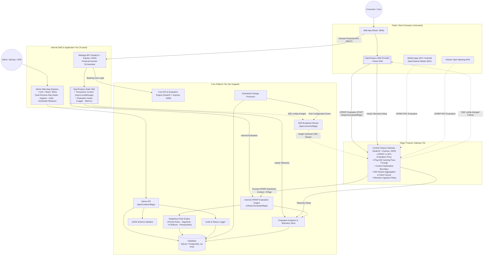
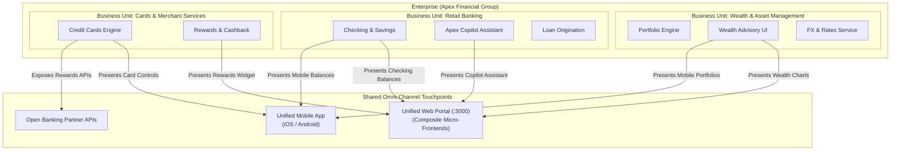
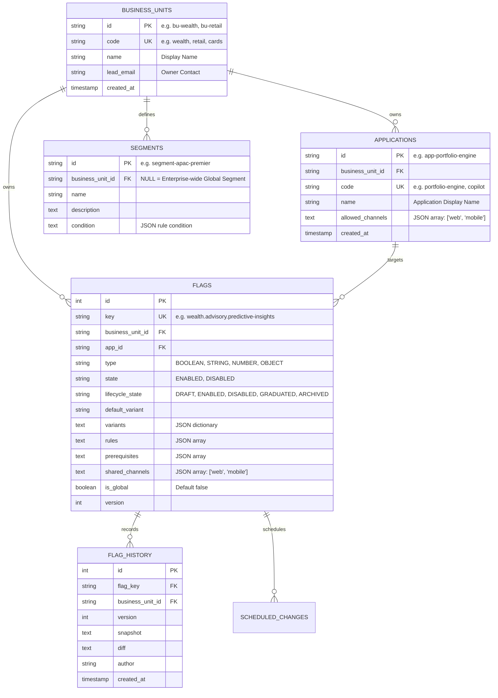
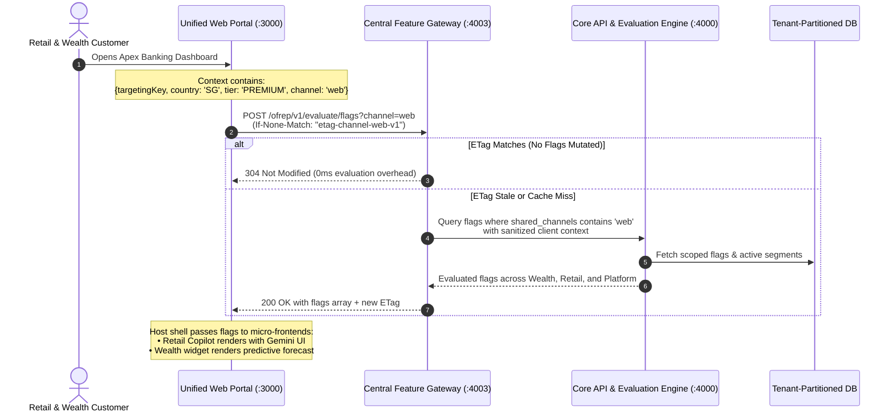

# INTENT

## Objective/s
- Demonstrate the value of using OpenFeature in an enterprise setting through the development of a Proof-of-Concept.
- Demonstrate the value of creating a centralized, runtime configuration management capability.
- Provide a hands-on feel of the operational aspects of using feature flags for release management and scaling common, global codebases.

## Constraints
- Build only. No commercial options allowed.
- SQLite for persistence out of the box, with a database abstraction layer (Knex.js) ensuring zero-code-change swappability to PostgreSQL.

## Requirements

### Functional Requirements

#### Feature Flag and Configuration Consumption
- **Unified OpenFeature Flag Types**: Dynamic configurations and feature toggles are unified under OpenFeature typed evaluations: `Boolean`, `String`, `Number`, and `Object` (structured JSON config).
- **Evaluation Semantics & Safe Defaults**:
  - Evaluation follows standard OpenFeature semantics: consumers provide a fallback default value (from environment variables or hardcoded constants).
  - If a flag is disabled, not found, or encounters an evaluation error, the OpenFeature SDK safely falls back to the consumer-provided default value with resolution reason (`DISABLED`, `DEFAULT`, or `ERROR`).
- **Context-Aware Evaluation & Rule Precedence**:
  - Multi-dimensional variations (defaults, operational preferences, business-unit levels, country levels) are resolved dynamically using an **Evaluation Context** (e.g. `targetingKey`, `country`, `businessUnit`, `appId`, `environment`).
  - Rules are evaluated in an explicit **Rule Priority Hierarchy** (e.g., Target User > Country > Business Unit > Default Variant).
- **Percentage / Gradual Rollouts**:
  - Rules support percentage-based fractional rollouts using deterministic hashing (MurmurHash3) on `targetingKey`, ensuring **sticky bucketing** — the same user consistently receives the same variant across evaluations.
  - Enables canary-style release patterns (e.g., "roll out to 10% of users, monitor, then ramp to 50%") without infrastructure changes.
- **Flag Dependencies / Prerequisites**:
  - Flags can declare prerequisite flags that must resolve to a specific variant before the dependent flag's own rules are evaluated.
  - If any prerequisite is unmet, the dependent flag returns its default variant with resolution reason `PREREQUISITE_FAILED`.
  - Prevents cascading misconfigurations when features depend on each other (e.g., `feature.advanced-financial-insights` requires `feature.chatbot-gemini-ui` to be enabled).

#### Flag Scoping and Multi-Application Coordination
- Feature flags are scoped using OpenFeature Scopes/Domains and context attributes (`appId`, `appGroup`, `environment`).
- Flags can be tagged and grouped across multiple consumer applications (e.g. `webapp` and `bff`) to enable coordinated multi-tier rollouts.
- **Reusable User Segments**: Targeting audiences (e.g., "Premium APAC Users", "Internal Beta Testers") are defined as named, reusable segments with their own conditions. Flag rules reference segments by ID, reducing duplication and ensuring consistency across the flag inventory.

#### Feature Flag Inventory, Lifecycle & History
- The Admin Web App must display an inventory of all feature flags including:
  - Key, Type, Lifecycle State
  - Application tags and scope
  - Creation date, age, last updated timestamp, and description
- Inspect the **last 5 revisions** of any feature flag or dynamic configuration, displaying full snapshots, change diffs, author, and timestamp.
- **Flag Lifecycle State Machine**: Flags progress through defined lifecycle states — `DRAFT` → `ENABLED` → `DISABLED` → `GRADUATED` → `ARCHIVED`.
  - `DRAFT` flags are not evaluable (return default value).
  - `GRADUATED` flags are frozen and read-only — indicating the feature is permanent and the flag code reference should be removed.
  - `ARCHIVED` flags are soft-deleted and hidden from the active inventory.
- **Stale Flag Detection & Hygiene**: The Admin Web App surfaces flags needing attention:
  - Flags with `state: ENABLED` and no rule changes in 30+ days.
  - Flags where 100% of evaluations resolve to the same variant (effectively hardcoded).
  - Flags with `state: DISABLED` for 14+ days (candidates for deletion or archival).

#### Feature Flag Authoring & Governance
- **OpenFeature & OFREP Conformance**: Core API evaluation endpoints conform to the OpenFeature Remote Evaluation Protocol (OFREP) specification.
- **Audit Logging**: Every create, update, and delete operation is recorded in an immutable audit log (`flag_history`).
- **Description**: Each feature flag or configuration must have a descriptive summary of its purpose.
- **Schema Validation**: JSON Schema (Draft 7/2020-12) validation for `OBJECT` variant payloads to ensure configuration integrity before persistence.
- **Scheduled Flag Changes**: Flag mutations (state changes, rule updates, variant swaps) can be scheduled for a future timestamp and applied automatically. Supports time-based release management scenarios such as marketing campaign launches, maintenance windows, and regulatory go-live dates.
- **Extensibility** (Future): Maker-checker approval workflow hooks for production sign-offs.

#### OpenFeature SDK Extensibility
- **Evaluation Lifecycle Hooks**: Consumer applications register OpenFeature hooks (`before`, `after`, `error`, `finally`) to extend the evaluation pipeline without modifying flag evaluation call sites:
  - **Evaluation Logger Hook** (`after` + `error`): Emits structured JSON logs for every flag evaluation — `{ flagKey, variant, reason, latencyMs, targetingKey }`.
  - **Metrics Hook** (`finally`): Increments evaluation counters partitioned by flag key, variant, and resolution reason; records evaluation latency.
  - **Context Enrichment Hook** (`before`): Auto-injects server-side context (request metadata, `appId`, session ID) into the evaluation context so callers don't need to manually construct it.
- **Transaction Context Propagation**: The BFF uses Node.js `AsyncLocalStorage` via OpenFeature's `TransactionContextPropagator` to bind user context (from request headers) once in Express middleware. All downstream `client.getBooleanValue()` calls automatically receive the context without explicit parameter passing.
- **Tracking API**: Consumer applications use `client.track(eventName, context, details)` to record user behaviours and conversion events (e.g., `chatbot_message_sent`, `loan_simulated`) through the OpenFeature client, linking feature flag exposure to business outcomes without coupling to vendor-specific analytics SDKs.

### Non-Functional Requirements
- **API Standards**: Core API must follow OpenAPI (REST) specifications for evaluation and administrative operations.
- **Change Propagation & Eventing**:
  - Core API provides a Server-Sent Events (SSE) stream (`/api/v1/events/flags`) broadcasting `PROVIDER_CONFIGURATION_CHANGED` events upon flag mutations.
  - OpenFeature SDK providers listen to the SSE stream to invalidate local cache and trigger reactive UI/service re-evaluations instantly.
  - Configurable fallback REST polling interval for disconnected or non-streaming clients.
- **Bulk Evaluation with HTTP Caching**: OFREP bulk evaluation responses include an `ETag` header (derived from flag version hashes). Subsequent client requests with `If-None-Match` receive `304 Not Modified` when no flags have changed, minimising bandwidth and re-rendering latency.
- **Evaluation Analytics**: Each OFREP evaluation is counted by `{ flagKey, variant, reason }`. The Admin Web App displays evaluation distribution (variant split per flag) to answer: *"Which flags are being used, by whom, and how often?"*

---

## High-level Solution

### Architecture Overview

The system architecture employs an **Edge Feature Gateway** (`feature-gateway` on port 4003) to air-gap the internal Core API & Rules Engine (`api:4000`) from untrusted public clients (Web, Mobile, Partner APIs). Public clients consume feature flags via the standard OpenFeature Remote Evaluation Protocol (OFREP v1) proxied through the Gateway with high-throughput ETag HTTP 304 caching, context sanitization, and SSE aggregation/fanout. Internal trusted services (WebApp BFF, Admin Web App) communicate with the Core Platform within the protected network boundary.



---

## Multi-Tenancy Architecture & Implementation Model

### 1. Enterprise Tenancy Mental Model & Scoping Hierarchy

In an enterprise banking institution (e.g., Apex Financial Group), feature flagging cannot be treated as a monolithic, single-team flat namespace. Instead, runtime configuration must support a multi-dimensional matrix spanning **Business Units (Tenants)**, **Applications (Microservices & Domain Systems)**, and **Shared Delivery Channels**:

1. **Enterprise / Organization (Root)**: The overarching financial institution governing shared infrastructure, baseline security policies, regulatory guardrails, and compliance audits.
2. **Business Unit (BU / Tenant)**: Autonomous organizational divisions with dedicated engineering, product, and business operations teams (e.g., *Retail Banking*, *Wealth & Asset Management*, *Cards & Merchant Services*, *Commercial Lending*). Each BU operates independently, maintains its own release cycles, and owns distinct operational budgets.
3. **Application / Service**: Technical systems owned and maintained by a specific BU. A single BU typically owns 3 to 10 distinct backend microservices, domain APIs, and frontend modules (e.g., Wealth BU owns `portfolio-simulation-engine`, `fx-rates-service`, `wealth-adviser-ui`; Retail BU owns `checking-accounts-service`, `loan-origination-service`, `chatbot-copilot-service`).
4. **Shared Delivery Channels**: Common customer and operator touchpoints (`web`, `mobile-ios`, `mobile-android`, `branch-teller`, `partner-api`). These channels are shared digital surfaces hosting composite UI widgets (micro-frontends, module federation, or component SDKs) and API gateways contributed by multiple BUs.



### 2. Flag Namespacing & Taxonomy Standard

To prevent key collisions, clarify ownership, and enforce blast radius boundaries, all feature flags adhere to a strict hierarchical taxonomy:

```
<tenant-bu>.<domain-or-app>.<feature-name>
```

- **Tenant Prefix (`<tenant-bu>`)**: Matches the owning Business Unit code (e.g., `wealth`, `retail`, `cards`, `lending`).
- **Domain / App (`<domain-or-app>`)**: Identifies the application, service, or functional module within the BU (e.g., `advisory`, `copilot`, `accounts`, `rewards`).
- **Feature Name (`<feature-name>`)**: Semantic kebab-case name of the toggle or dynamic configuration (e.g., `predictive-insights`, `gemini-ui`, `instant-approval`).
- **Platform Namespace (`platform.*`)**: Reserved exclusively for enterprise-wide infrastructure flags (e.g., `platform.maintenance-banner`, `platform.auth.v2-oauth`) managed by central Platform / SRE teams.

| Flag Key | Owning Business Unit | Owning Application | Target Delivery Channels | Description |
| :--- | :--- | :--- | :--- | :--- |
| `wealth.advisory.predictive-insights` | Wealth & Asset Mgmt | `wealth-adviser-ui` | `web`, `mobile` | AI-powered wealth modeling & 5-year forecast charts |
| `retail.copilot.gemini-ui` | Retail Banking | `chatbot-copilot-service` | `web`, `mobile` | Contextual conversational AI with Generative UI cards |
| `retail.accounts.instant-settlement` | Retail Banking | `checking-accounts-service` | `web`, `mobile`, `partner` | Real-time interbank transaction settlement protocol |
| `cards.rewards.travel-multiplier` | Cards & Payments | `rewards-cashback-service` | `web`, `mobile` | 3x travel reward point accelerator |
| `platform.network.maintenance-mode` | Platform Operations | Central Gateway / Shell | `web`, `mobile`, `partner` | Global emergency circuit breaker and banner |

### 3. Multi-Tenant Relational Data Architecture

To maintain the architectural constraint of **zero-code-change swappability between SQLite (POC) and PostgreSQL (Production)**, multi-tenancy is implemented using a **Shared Database with Tenant Discriminator** pattern rather than dynamic schema-per-tenant isolation.



#### Key Relational Guardrails
- **Compound Query Indexes**: `CREATE INDEX idx_flags_bu_app ON flags(business_unit_id, app_id, lifecycle_state)` enables sub-millisecond evaluation lookups partitioned by tenant.
- **Segment Scoping**: When `business_unit_id` is `NULL`, the audience segment is an **Enterprise Global Segment** (e.g., "APAC Premier Clients", "Internal Beta Testers") available to all BUs. When set, the segment is strictly private to that BU.
- **Cross-Tenant Integrity**: Foreign keys ensure flags cannot be created for non-existent applications or orphaned BUs.

### 4. Omni-Channel OFREP Evaluation & Gateway Filtering

When multi-tenant applications interact with common channels, flag evaluations must be efficiently routed and cached without cross-tenant data leakage. The **Central Feature Gateway** (`:4003`) serves as the edge router and caching boundary:



#### Query Modes Supported by the Gateway:
1. **Channel-Aggregated Evaluation (`?channel=web`)**: Used by common frontend shells (Web Portal, Mobile App) to evaluate all flags active for that channel across all business units in a single round-trip.
2. **Tenant & Application Scoped Evaluation (`?bu=wealth&appId=wealth-adviser-ui`)**: Used by dedicated microservices, backend BFFs, and standalone domain apps to evaluate only the flags belonging to their specific boundary.
3. **Partitioned ETag Caching**: The Gateway derives ETags as `MD5(channelId + buId + flagVersionFingerprint + contextHash)`, ensuring a change to a Retail flag never invalidates the client-side cache for Wealth flags.

### 5. OpenFeature Named Clients & Domains in Composite Frontends

In modular frontends (such as Module Federation or micro-frontends embedded within the Web App), each business unit's team authors independent UI components. They consume feature flags cleanly without collision using OpenFeature **Domains / Named Clients**:

```javascript
import { OpenFeature } from '@openfeature/web-sdk';

// 1. Host Shell initializes the shared OfrepWebProvider pointing to the Feature Gateway
const gatewayProvider = new OfrepWebProvider({ baseUrl: 'http://localhost:4003' });
OpenFeature.setProvider(gatewayProvider);
OpenFeature.setContext({
  targetingKey: 'user-sg-vip',
  country: 'SG',
  userTier: 'PREMIUM',
  channel: 'web'
});

// 2. Wealth Management Micro-Frontend accesses its scoped domain client
const wealthClient = OpenFeature.getClient('wealth-management');
const showWealthForecast = await wealthClient.getBooleanValue(
  'wealth.advisory.predictive-insights',
  false
);

// 3. Retail Banking Copilot Micro-Frontend accesses its scoped domain client
const retailClient = OpenFeature.getClient('retail-banking');
const enableGeminiCards = await retailClient.getBooleanValue(
  'retail.copilot.gemini-ui',
  false
);
```

#### Benefits of Named Clients:
- **Encapsulation**: Each BU's team works with a domain-specific client that can attach BU-specific evaluation hooks (e.g., custom telemetry tags, domain metrics).
- **Default Fallback Safety**: If the Feature Gateway is unreachable or an evaluation times out, the local consumer-provided fallback variant (`false`) is immediately returned, guaranteeing that an issue in one BU's flag never degrades another BU's micro-frontend.

### 6. Governance, RBAC & Blast Radius Isolation

Multi-tenancy requires strict operational guardrails in the **Engineering & BizOps Admin Console** (`admin-webapp`):

1. **Role-Based Access Control (RBAC)**:
   - **Enterprise Admin / SRE**: Full administrative authority over all business units, platform-level flags (`platform.*`), and global audience segments.
   - **Tenant Admin (Business Unit Lead)**: Complete control over their BU's flags, rules, and scheduled releases. Cannot modify or disable flags belonging to other BUs.
   - **Tenant Operator / Product Manager**: Can modify percentage rollouts and toggle non-critical flags within their BU using the no-code Business Operations mode in Flag Studio.
   - **Auditor / Compliance Officer**: Read-only visibility across all flags, audit diffs, and evaluation metrics for regulatory compliance.

2. **Blast Radius Containment & Independent Kill Switches**:
   - **Autonomous Emergency Cutoff**: If a model anomaly occurs in `retail.copilot.gemini-ui`, the Retail operations team can immediately trip the kill switch. The Apex Copilot gracefully falls back to text-only mode on the Web App while Wealth Advisory charts, checking account transactions, and FX rates continue running uninterrupted.
   - **Prerequisite Boundary Enforcers**: A flag prerequisite can only reference another flag owned by the same Business Unit, unless the target flag is an approved, enterprise-wide `platform.*` flag. This prevents hidden cross-team release coupling and cascading failures.