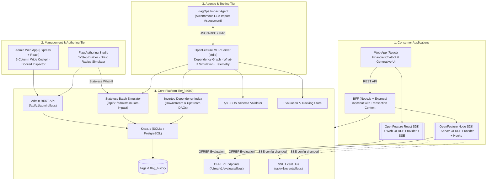

# Implementation Plan: OpenFeature Enterprise Platform & Agentic Impact Engine

This plan establishes the architecture, database schema, OFREP evaluation engine, SSE event stream, wide-viewport Admin management cockpit, Flag Authoring Studio, BFF, React financial demo application, and the **Agentic Impact Assessment & Blast Radius Engine** for the OpenFeature Enterprise platform as defined in [INTENT.md](file:///Users/bienmandac/projects/open-feature-poc/INTENT.md) and [AGENTS.md](file:///Users/bienmandac/projects/open-feature-poc/AGENTS.md).

---

## Status & Milestones

- ✅ **Core Platform Tier (`api`)**: Knex DB (SQLite / PostgreSQL), OFREP RFC protocol, Ajv Draft 2020-12 schema validation, SSE event bus, telemetry store, and scheduled release processor.
- ✅ **Management Tier (`admin-webapp`)**: High-density 3-column financial cockpit, live OFREP Evaluation Playground, persistent Context Inspector, and full-screen Flag Authoring Studio.
- ✅ **BFF Tier (`webapp-bff`)**: Express server with `@openfeature/server-sdk`, custom OFREP Server Provider, SSE auto-invalidation, and `AsyncLocalStorage` transaction context.
- ✅ **Consumer Tier (`webapp`)**: React + Vite financial chatbot with generative UI widgets, context switcher (Country, Tier, App Group), and `@openfeature/react-sdk`.
- ✅ **Agentic Impact Engine (`api/src/mcp`)**: Model Context Protocol (MCP) server, stateless What-If batch simulation API, inverted dependency graph indexer, and Studio automated blast radius analysis.

---

## Architecture & Data Flow

---

## Database Model & Schema Design

Using Knex migrations supporting SQLite (`better-sqlite3` / `sqlite3`) and PostgreSQL.

### Table: `flags`
* `id` (INTEGER PRIMARY KEY AUTOINCREMENT)
* `key` (VARCHAR UNIQUE NOT NULL, e.g. `feature.chatbot-gemini-ui`, `config.chatbot-limits`)
* `type` (VARCHAR NOT NULL: `BOOLEAN`, `STRING`, `NUMBER`, `OBJECT`)
* `state` (VARCHAR NOT NULL: `ENABLED`, `DISABLED`)
* `lifecycle_state` (VARCHAR NOT NULL: `DRAFT`, `ENABLED`, `DISABLED`, `GRADUATED`, `ARCHIVED`)
* `default_variant` (VARCHAR NOT NULL)
* `graduated_variant` (VARCHAR NULL)
* `variants` (JSON / TEXT NOT NULL - Key/Value pairs of variant values)
* `rules` (JSON / TEXT NOT NULL - Ordered array of `{ id, priority, condition, variant, rollout }`)
* `prerequisites` (JSON / TEXT NOT NULL - Array of `{ flagKey, variant }`)
* `schema` (JSON / TEXT NULL - JSON Schema Draft 2020-12 for validating `OBJECT` type variants)
* `app_tags` (JSON / TEXT NOT NULL - e.g. `["webapp", "bff"]`)
* `description` (TEXT NOT NULL)
* `version` (INTEGER NOT NULL DEFAULT 1)
* `created_at` (DATETIME DEFAULT CURRENT_TIMESTAMP)
* `updated_at` (DATETIME DEFAULT CURRENT_TIMESTAMP)

### Table: `flag_history`
* `id` (INTEGER PRIMARY KEY AUTOINCREMENT)
* `flag_key` (VARCHAR NOT NULL)
* `version` (INTEGER NOT NULL)
* `snapshot` (JSON / TEXT NOT NULL - Full copy of flag state at this version)
* `diff` (JSON / TEXT NOT NULL - Structured diff showing changed fields)
* `author` (VARCHAR NOT NULL)
* `change_reason` (TEXT NULL)
* `created_at` (DATETIME DEFAULT CURRENT_TIMESTAMP)

### Table: `segments`
* `id` (VARCHAR PRIMARY KEY, e.g. `segment-apac-wealth`)
* `name` (VARCHAR NOT NULL)
* `description` (TEXT NULL)
* `condition` (JSON / TEXT NOT NULL)
* `created_at` (DATETIME DEFAULT CURRENT_TIMESTAMP)
* `updated_at` (DATETIME DEFAULT CURRENT_TIMESTAMP)

### Table: `scheduled_changes`
* `id` (INTEGER PRIMARY KEY AUTOINCREMENT)
* `flag_key` (VARCHAR NOT NULL)
* `scheduled_at` (DATETIME NOT NULL)
* `change_type` (VARCHAR NOT NULL)
* `payload` (JSON / TEXT NOT NULL)
* `status` (VARCHAR NOT NULL DEFAULT 'PENDING')
* `author` (VARCHAR NOT NULL)
* `created_at` (DATETIME DEFAULT CURRENT_TIMESTAMP)

---

## Architectural Components

### 1. Core API (`/api` · Port 4000)
* **OFREP Protocol**: Conforms to standard `POST /ofrep/v1/evaluate/flags/{key}` and bulk evaluation with HTTP 304 `ETag` caching.
* **Evaluation Engine**: Implements rule precedence (User ID $\rightarrow$ Country $\rightarrow$ Business Unit $\rightarrow$ Segments $\rightarrow$ Default) with MurmurHash3 sticky fractional rollouts and recursive prerequisite checking.
* **Inverted Dependency Index**: $O(1)$ reverse lookup in `flagService.js` mapping upstream flags to direct and transitive downstream dependents.
* **Stateless Batch What-If Simulator**: `POST /api/v1/admin/simulate-impact` runs in-memory comparative evaluations across synthetic banking cohorts to calculate blast radius without database writes.
* **Ajv JSON Schema Validator**: Enforces Draft 2020-12/Draft 7 schemas on `OBJECT` configurations.

### 2. OpenFeature MCP Server (`api/src/mcp` · Stdio)
* Model Context Protocol (MCP) server enabling AI agents to autonomously assess changes:
  * `list_flags`: Lists inventory with scope, type, and lifecycle filters.
  * `get_flag_details`: Returns full flag specification.
  * `get_downstream_dependents`: Returns direct and transitive downstream dependents.
  * `get_dependency_graph`: Returns complete DAG of flag dependencies.
  * `simulate_flag_impact`: Executes stateless what-if blast radius simulations.
  * `get_flag_telemetry`: Fetches QPS, error counts, and track events.
  * `validate_variant_schema`: Validates object payloads against Draft 2020-12 schemas.

### 3. Admin Web App (`/admin-webapp` · Port 4001)
* **Wide-Viewport Cockpit**: Full `100vw × 100vh` canvas with Left Navigation Rail (`SidebarRail.jsx`), Top Telemetry Pulse (`InstitutionalHeader.jsx`), and High-Density Operations Workbench (`FlagInventory.jsx`).
* **Context Inspector**: Docked 420px panel with interactive **OFREP Evaluation Playground**, Rule Tree Inspector, JSON Schema Editor, and Downstream Dependents tracker.
* **Full-Screen Flag Studio (`FlagStudio.jsx`)**: 2-column authoring environment with 5-step guided builder, visual condition cards, MurmurHash3 rollout sliders, and live server-side Blast Radius & Dependency Impact analysis.

### 4. WebApp BFF (`/webapp-bff` · Port 4002)
* Custom OFREP Server Provider listening to SSE stream for zero-downtime cache invalidation.
* Node.js `AsyncLocalStorage` transaction context propagation injecting user request context once in Express middleware.
* Financial Chatbot endpoints demonstrating server-side generative UI flag gating.

### 5. Demo WebApp (`/webapp` · Port 3000)
* Financial dashboard and chatbot demonstrating real-time UI transitions driven by OpenFeature evaluations.
* Interactive Context Switcher bar (toggling Country, Tier, and App Scope).

---

## Verification Plan

### Automated Tests
1. **Core API, Graph & Simulation Tests**:
   * Command: `npm test --prefix api`
   * Covers OFREP endpoints, ETag caching, rule priorities, prerequisite cascades, inverted dependency graphs, and stateless what-if simulations.
2. **MCP Server Tool Suite Tests**:
   * Command: `npm test --prefix api` (`tests/mcp.test.js`)
   * Verifies tool registration and execution.
3. **BFF Integration Tests**:
   * Command: `npm test --prefix webapp-bff`
   * Verifies server-side evaluation, logger hooks, and transaction context propagation.

### Manual Verification
1. **Automated Blast Radius Simulation in Flag Studio**:
   * Open Admin Web App (`http://localhost:4001`).
   * Edit `feature.chatbot-gemini-ui` in Flag Studio and change state to `DISABLED`.
   * Click **Analyze Impact** in the right Pre-Flight Validation Deck.
   * Verify that the calculated blast radius is rendered, and downstream dependent `feature.advanced-financial-insights` is flagged with prerequisite failure warnings.
2. **Real-time SSE Propagation**:
   * Open Web App (`http://localhost:3000`) and Admin App (`http://localhost:4001`) side by side.
   * Toggle a flag in the Admin App and observe instant UI update in the Web App without page reload.
3. **MCP Tool Invocation**:
   * Run `node api/src/mcp/server.js` and verify JSON-RPC tool-calling using any standard MCP client.
