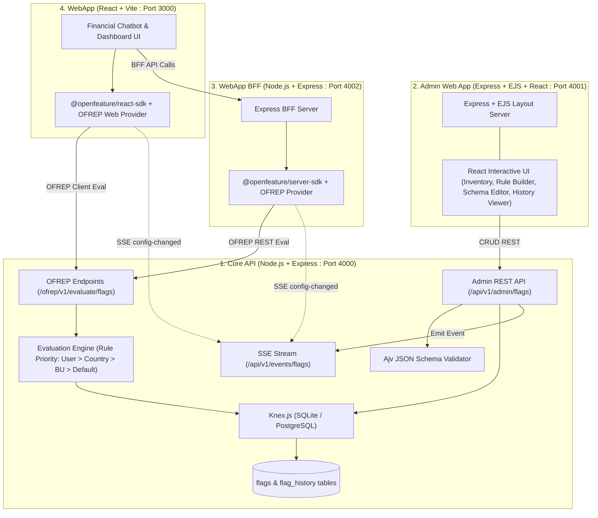

# Implementation Plan: OpenFeature Enterprise Proof-of-Concept

This plan establishes the architecture, database schema, OFREP evaluation engine, SSE event stream, Admin management UI, BFF, and React demo application for the OpenFeature POC as defined in [INTENT.md](file:///Users/bienmandac/projects/open-feature-poc/INTENT.md) and [AGENTS.md](file:///Users/bienmandac/projects/open-feature-poc/AGENTS.md).

---

## User Review Required

> [!IMPORTANT]
> **OpenFeature Protocol Alignment**: 
> The Core API implements the standard **OFREP (OpenFeature Remote Evaluation Protocol)** specification (`POST /ofrep/v1/evaluate/flags/{key}` and `POST /ofrep/v1/evaluate/flags` for bulk evaluation). Evaluation responses conform to OFREP schema (`value`, `key`, `reason`, `variant`, `metadata`).

> [!NOTE]
> **Real-time Synchronization**:
> A Server-Sent Events (SSE) channel at `/api/v1/events/flags` broadcasts `PROVIDER_CONFIGURATION_CHANGED` on any flag mutation in the Core API. Both the React WebApp OpenFeature Web Provider and the BFF OpenFeature Server Provider listen to this stream to invalidate cached evaluations immediately.

---

## Architecture & Data Flow

---

## Database Model & Schema Design

Using Knex migrations supporting SQLite (`better-sqlite3` or `sqlite3`) and PostgreSQL.

### Table: `flags`
- `id` (INTEGER PRIMARY KEY AUTOINCREMENT)
- `key` (VARCHAR UNIQUE NOT NULL, e.g. `feature.chatbot-v2`, `config.rate-limits`)
- `type` (VARCHAR NOT NULL: `BOOLEAN`, `STRING`, `NUMBER`, `OBJECT`)
- `state` (VARCHAR NOT NULL: `ENABLED`, `DISABLED`)
- `default_variant` (VARCHAR NOT NULL)
- `variants` (JSON / TEXT NOT NULL - Key/Value pairs of variant values)
- `rules` (JSON / TEXT NOT NULL - Ordered array of `{ id, priority, condition, variant }`)
- `schema` (JSON / TEXT NULL - JSON Schema for validating `OBJECT` type variants)
- `app_tags` (JSON / TEXT NOT NULL - e.g. `["webapp", "bff"]`)
- `description` (TEXT NOT NULL)
- `version` (INTEGER NOT NULL DEFAULT 1)
- `created_at` (DATETIME DEFAULT CURRENT_TIMESTAMP)
- `updated_at` (DATETIME DEFAULT CURRENT_TIMESTAMP)

### Table: `flag_history`
- `id` (INTEGER PRIMARY KEY AUTOINCREMENT)
- `flag_key` (VARCHAR NOT NULL)
- `version` (INTEGER NOT NULL)
- `snapshot` (JSON / TEXT NOT NULL - Full copy of flag state at this version)
- `diff` (JSON / TEXT NOT NULL - Structured diff showing changed fields)
- `author` (VARCHAR NOT NULL)
- `change_reason` (TEXT NULL)
- `created_at` (DATETIME DEFAULT CURRENT_TIMESTAMP)

---

## Proposed Implementation by Component

### 1. Root Workspace & Shared Tooling
#### [NEW] `package.json` (root workspace config)
- Sets up npm workspaces: `api`, `admin-webapp`, `webapp-bff`, `webapp`
- Root scripts: `npm run dev`, `npm run build`, `npm run test`

---

### 2. Core API (`/api`)
#### [NEW] `api/package.json`
- Dependencies: `express`, `cors`, `knex`, `better-sqlite3` / `sqlite3`, `pg`, `ajv`, `ajv-formats`, `dotenv`, `zod`
- DevDependencies: `nodemon`, `supertest`, `jest`
#### [NEW] `api/src/db/knexfile.js`
- Knex configuration connecting to SQLite by default (`data/flags.sqlite`) or PostgreSQL via `DATABASE_URL`.
#### [NEW] `api/src/db/migrations/001_create_flags_and_history.js`
- Migration definitions for `flags` and `flag_history` tables.
#### [NEW] `api/src/db/seeds/001_default_flags.js`
- Seeds demo flags:
  1. `feature.chatbot-gemini-ui` (BOOLEAN): Enables generative UI widgets in chatbot.
  2. `feature.advanced-financial-insights` (BOOLEAN): Rule-based country/tier rollout.
  3. `config.chatbot-limits` (OBJECT): Validated JSON Schema config for rate limits, session timeout, model temperature.
  4. `config.banner-announcement` (STRING / OBJECT): Multi-tier marketing banners.
#### [NEW] `api/src/engine/evaluator.js`
- Core evaluation engine matching OpenFeature context (`targetingKey`, `country`, `businessUnit`, `appId`, `environment`) against ordered rules:
  - If `state === 'DISABLED'`: return disabled reason (`DISABLED`).
  - Match rules in order:
    - User ID / Targeting Key match
    - Country match (`context.country === rule.condition.country`)
    - Business Unit match (`context.businessUnit === rule.condition.businessUnit`)
    - Custom attribute expressions
  - Return resolved variant and value with reason `TARGETING_MATCH` or `DEFAULT`.
#### [NEW] `api/src/services/flagService.js`
- Flag CRUD, JSON Schema validation via `Ajv`, version incrementing, diff generation, and immutable history recording.
#### [NEW] `api/src/services/eventEmitter.js`
- In-memory event bus managing connected SSE clients and broadcasting `PROVIDER_CONFIGURATION_CHANGED` on flag changes.
#### [NEW] `api/src/routes/ofrep.js`
- Standard OFREP routes:
  - `POST /ofrep/v1/evaluate/flags/{key}`
  - `POST /ofrep/v1/evaluate/flags` (Bulk evaluation)
#### [NEW] `api/src/routes/events.js`
- `GET /api/v1/events/flags` (SSE stream for change notifications)
#### [NEW] `api/src/routes/admin.js`
- Admin CRUD endpoints:
  - `GET /api/v1/admin/flags` (List all flags with age, update info, tags)
  - `GET /api/v1/admin/flags/:key` (Get single flag)
  - `POST /api/v1/admin/flags` (Create new flag with schema validation)
  - `PUT /api/v1/admin/flags/:key` (Update flag with schema validation and history entry)
  - `DELETE /api/v1/admin/flags/:key` (Delete flag and record in history)
  - `GET /api/v1/admin/flags/:key/history` (Get last 5+ revisions with diffs)
#### [NEW] `api/src/app.js` & `api/src/server.js`
- Express application bootstrap listening on port 4000.

---

### 3. Admin Web App (`/admin-webapp`)
#### [NEW] `admin-webapp/package.json`
- Dependencies: `express`, `ejs`, `react`, `react-dom`, `lucide-react`, `tailwindcss`
#### [NEW] `admin-webapp/src/views/layout.ejs` & `admin-webapp/src/views/index.ejs`
- EJS base template serving navigation, system header, and container divs for React interactive islands.
#### [NEW] `admin-webapp/src/client/components/FlagInventory.jsx`
- Interactive table showing flags, state badges, application tags, creation date, age, and quick toggle switches.
#### [NEW] `admin-webapp/src/client/components/FlagEditor.jsx`
- Form for creating/editing flags, configuring variants, writing targeting rules, and testing JSON Schema.
#### [NEW] `admin-webapp/src/client/components/HistoryTimeline.jsx`
- Visual timeline displaying the last 5 revisions, author, timestamp, change reasons, and interactive JSON diff inspector.
#### [NEW] `admin-webapp/src/server.js`
- Express server on port 4001 proxying API requests and rendering EJS views.

---

### 4. WebApp BFF (`/webapp-bff`)
#### [NEW] `webapp-bff/package.json`
- Dependencies: `express`, `cors`, `@openfeature/server-sdk`, `axios`, `eventsource`, `dotenv`
#### [NEW] `webapp-bff/src/openfeature/OfrepServerProvider.js`
- Custom OFREP Server Provider for OpenFeature Node SDK:
  - Performs evaluations against Core API OFREP endpoint.
  - Subscribes to SSE `/api/v1/events/flags` and emits `PROVIDER_CONFIGURATION_CHANGED` to notify the Node OpenFeature client.
#### [NEW] `webapp-bff/src/routes/chat.js`
- Financial Chatbot backend endpoints demonstrating server-side flag evaluation:
  - Evaluates `feature.chatbot-gemini-ui` and `config.chatbot-limits` in request context (User ID, User Tier, Country).
  - Returns appropriate chatbot response and generative UI payload depending on feature state.
#### [NEW] `webapp-bff/src/server.js`
- Express server running on port 4002.

---

### 5. Demo WebApp (`/webapp`)
#### [MODIFY] `webapp/package.json`
- Dependencies: `react`, `react-dom`, `@openfeature/react-sdk`, `@openfeature/web-sdk`, `lucide-react`, `tailwindcss`, `vite`
#### [NEW] `webapp/src/openfeature/OfrepWebProvider.js`
- OpenFeature Web Provider connecting to Core API OFREP and SSE stream.
#### [NEW] `webapp/src/components/Chatbot.jsx`
- Financial chatbot demonstrating dynamic UI capabilities based on OpenFeature flags:
  - Evaluates boolean toggles and object configs (banner, quick actions, generative chart widgets).
  - Context switcher bar (allowing the user to change User ID, Country, Tier, and App Group on the fly to see live flag evaluation transitions).
#### [NEW] `webapp/src/components/ContextBar.jsx`
- Interactive toolbar to toggle simulation context (Country: `SG`, `US`, `PH`; Tier: `STANDARD`, `PREMIUM`).
#### [NEW] `webapp/src/App.jsx` & `webapp/src/main.jsx`
- App bootstrap with OpenFeatureProvider wrapping the application.

---

## Verification Plan

### Automated Tests
1. **Core API Unit & Integration Tests**:
   - Run: `cd api && npm test`
   - Tests OFREP evaluation (`/ofrep/v1/evaluate/flags/{key}` for boolean, string, number, object).
   - Tests Rule evaluation precedence (User > Country > BU > Default).
   - Tests JSON Schema validation on invalid `OBJECT` variant payloads.
   - Tests `flag_history` recording and diff computation.
2. **BFF Integration Tests**:
   - Run: `cd webapp-bff && npm test`
   - Tests OpenFeature evaluation context passing and fallback handling on API unavailability.

### Manual Verification Flows
1. **Flag Creation & Schema Validation**:
   - Open Admin Web App (`http://localhost:4001`).
   - Create an `OBJECT` configuration flag with a JSON schema requiring `maxTokens` (integer) and `temperature` (number).
   - Verify invalid JSON inputs are blocked with validation errors.
2. **Real-time SSE Propagation Demo**:
   - Open Web App (`http://localhost:3000`) and Admin Web App (`http://localhost:4001`) side by side.
   - Toggle `feature.chatbot-gemini-ui` in the Admin App.
   - Verify the Web App immediately updates its UI without manual page reload via the SSE `PROVIDER_CONFIGURATION_CHANGED` event.
3. **Context-Aware Targeting Demo**:
   - In the Web App context switcher, change country from `US` to `SG`.
   - Verify that regional-specific flag variants / banner configurations take effect dynamically.
4. **Audit History & Diff Inspection**:
   - In the Admin Web App, inspect the `HistoryTimeline` for a modified flag.
   - Verify the last 5 revisions are listed with author, timestamp, snapshot, and visual diffs.
5. **Database Swappability Verification**:
   - Run migration script against SQLite database.
   - Confirm Knex schema queries are fully compatible with standard SQL/PostgreSQL types.
